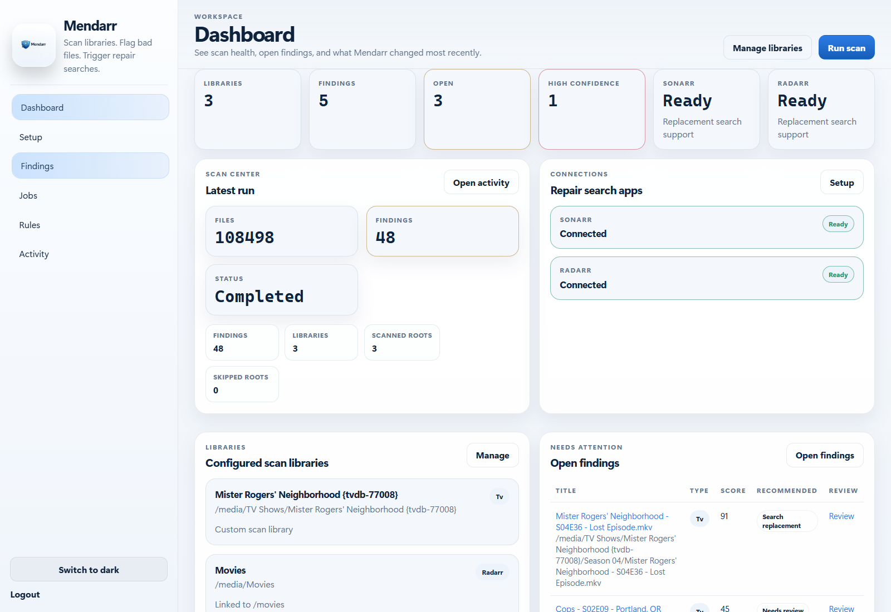
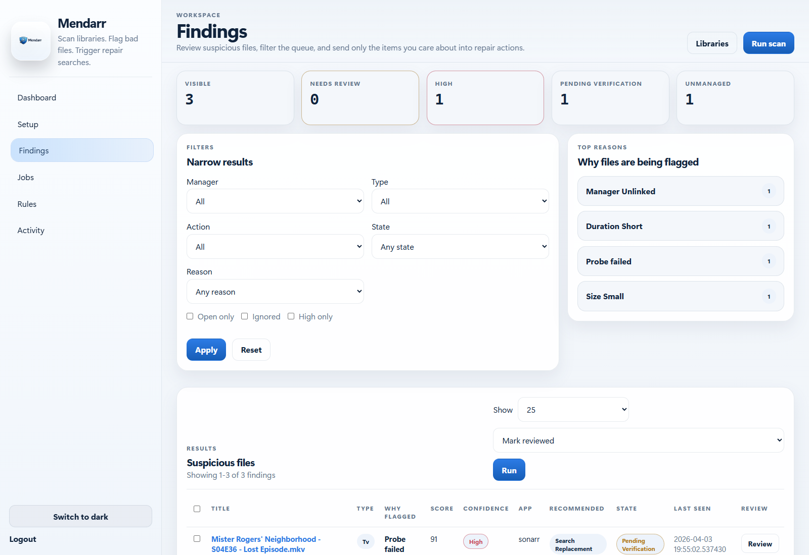
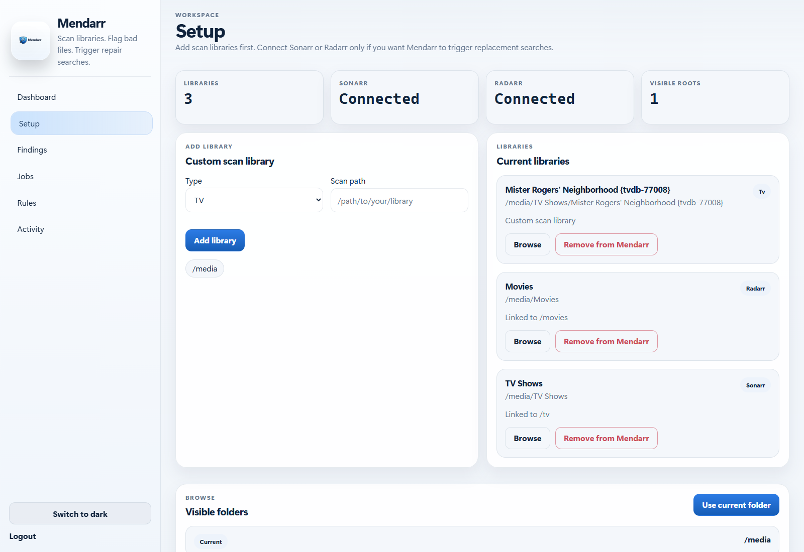
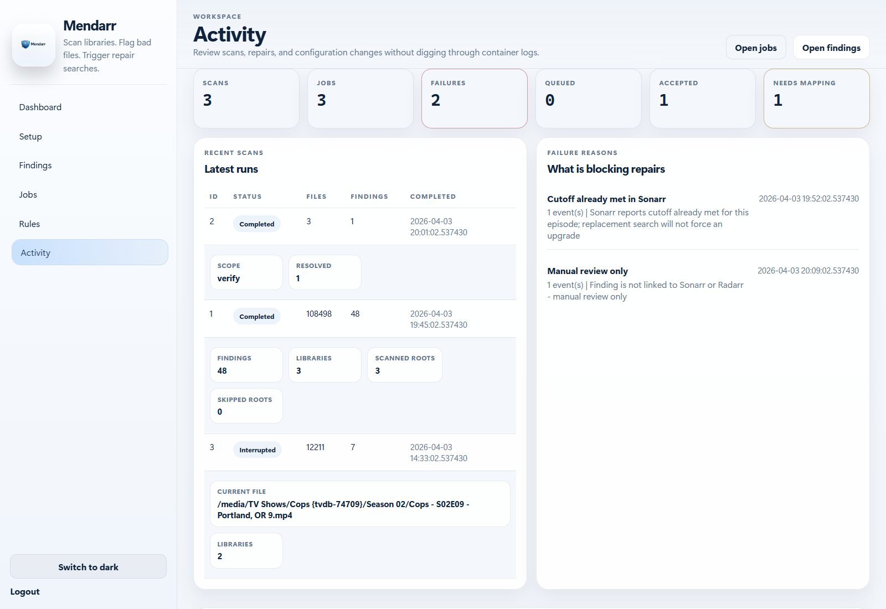

# Mendarr v1.0.0

<p align="center">
  
</p>

<p align="center">
  Mendarr audits large Sonarr and Radarr libraries, flags suspicious media imports, and sends safe repair requests back to the manager that owns the file.
</p>

<p align="center">
  Built for the moment when a media library gets too large to trust manual spot-checking.
</p>

<p align="center">
  <a href="https://buymeacoffee.com/necrul">Buy Me a Coffee</a>
</p>

## Why I Built Mendarr

I built Mendarr after finding zero-byte files and other broken media that looked fine at a glance but had no audio stream, no video stream, or probe failures hiding underneath.

That is manageable in a small library. It is not manageable in a large one.

Once a library is big enough, manual spot-checking stops working. Playback failures show up too late, broken upgrades can sit quietly for months, and it becomes difficult to tell which files are actually healthy versus which ones only look healthy by filename and size.

## What Mendarr Solves

When a library grows into tens or hundreds of thousands of files, bad imports stop being obvious:

- episodes that are too short, too small, or probe badly
- sample and trailer files mixed into main libraries
- manager metadata that no longer lines up with the file on disk
- imported upgrades that are actually broken
- "looks fine at a glance" libraries with quiet quality drift

Mendarr gives you a review queue instead of a guess-and-hope workflow.

- scan configured roots with `ffprobe`
- score suspicious files with rule-based checks
- map findings back to Sonarr or Radarr when possible
- queue manager-owned repair actions instead of deleting files directly
- keep an audit trail of scans, findings, jobs, and operator actions

## Why It Matters For Large Libraries

Mendarr is not trying to be another downloader or media server. It is a control layer for library integrity.

- It helps when the library is too large to manually inspect after every import.
- It keeps the remediation path inside Sonarr and Radarr, where quality profiles and search behavior already live.
- It surfaces patterns fast: broken upgrades, missing mappings, recurring failure reasons, and stale findings that need review.
- It works with read-only media mounts, which is the right default for cautious operators.

## Product Tour

### Dashboard

See scan health, current risk, integration readiness, recent jobs, and open findings in one place.



### Findings Workspace

Triage suspicious files, filter by reason or state, and queue only the items worth touching.



### Setup

Map what Mendarr can see on disk to what Sonarr and Radarr believe exists.



### Activity

Track scan history, repair failures, accepted search requests, and operator changes without tailing container logs.



## Feature Highlights

- Filesystem and `ffprobe`-based suspicion scoring
- TV and movie matching against Sonarr and Radarr metadata
- Manual remediation plus optional queued search requests
- Verify scans for re-checking known findings after a repair attempt
- Graceful library scan stop that interrupts after the current file
- Resume button for continuing an interrupted library scan from the last completed file
- Rule tuning for minimum sizes, durations, excluded paths, and ignored patterns
- Audit history for scans, findings, jobs, and setup changes
- SQLite by default for easy self-hosting
- Docker image with `ffprobe`, `tini`, and non-root runtime defaults
- Repo-backed update checks for future public releases

## What A Finding Means

Mendarr does not treat every suspicious file the same way. A finding is a review item that combines:

- one or more reasons
- a score from `0-100`
- a confidence level
- a recommended next action

The score is not a probability. It is a concern meter. Higher means "this deserves attention sooner."

Common findings in plain language:

- `Zero-byte file`: the file exists, but it contains no media data
- `Very small`: the file is much smaller than expected for a real episode or movie
- `Probe failed`: `ffprobe` could not read the container cleanly
- `No video stream`: the container opened, but no actual video stream was found
- `No audio`: a main feature file is missing audio streams
- `Short duration`: the file is too short to be a full episode or movie
- `Missing resolution` or `Missing codec`: metadata is incomplete or suspicious
- `Duplicate variant`: multiple files in the same folder look like competing copies of the same title
- `Trailer or extra inside main library`: sample, trailer, promo, or extras-style content is mixed into the primary media path
- `Ignored by rule`: the file matched one of your configured ignore or exclusion rules

How to interpret confidence:

- `high`: Mendarr found something strongly wrong or a combination of signals that usually points to a bad import
- `medium`: something looks off, but you should usually review it before acting
- `low`: weak signal only; useful for operator review, but not something Mendarr treats as urgent

If you want the lower-level rule and score details, see [docs/scoring-engine.md](docs/scoring-engine.md).

## What Each Action Does

Mendarr keeps actions intentionally conservative. It audits locally, then asks Sonarr or Radarr to do manager-owned work where possible.

- `Mark reviewed`: keeps the finding visible but moves it out of the brand-new/open pile
- `Ignore`: tells Mendarr to stop surfacing that finding unless you unignore it later
- `Unignore`: puts an ignored finding back into the normal queue
- `Rescan`: asks Sonarr or Radarr to refresh metadata or rescan the linked title
- `Search replacement`: asks the manager to search for a better copy without deleting the current file first
- `Delete and replace`: asks the manager to delete the current file and then search again; this is the riskiest option because a replacement is not guaranteed
- `Run verify scan`: rechecks the file after a repair attempt so Mendarr can confirm whether the problem is actually gone

What the recommended action usually means:

- `review`: operator judgment still matters, or the file is not linked to Sonarr/Radarr
- `rescan_only`: the file is linked and suspicious enough that a manager refresh/rescan is a safe first step
- `search_replacement`: the file looks bad enough that Mendarr thinks a new release may be needed
- `ignore`: a rule or context makes the file safe to suppress

What the states mean:

- `Needs review`: open and awaiting operator action
- `Pending verification`: a manager action was queued or ran, but Mendarr has not confirmed the outcome yet
- `Resolved`: the issue no longer appears in the latest scan or verify pass
- `Ignored`: hidden from normal review until restored

## Support Mendarr

If Mendarr saves you time or helps keep a large library under control, you can support the project here:

- [Buy Me a Coffee](https://buymeacoffee.com/necrul)

## Quick Start

### Docker

For a quick local run:

```bash
docker build -t mendarr .
docker run -p 8095:8095 \
  -e MENDARR_SECRET_KEY=replace-me \
  -e MENDARR_ENCRYPTION_KEY=replace-me-with-a-second-secret \
  -e MENDARR_ADMIN_PASSWORD=replace-me \
  -v mendarr-data:/data \
  -v /your/media:/your/media:ro \
  mendarr
```

If Mendarr is running on the same machine as your browser, open [http://127.0.0.1:8095](http://127.0.0.1:8095).

If Mendarr is running on another host, NAS, or server, replace `127.0.0.1` with that machine's IP or hostname. Example: `http://192.168.1.20:8095`.

### Pull The Public Image

If you prefer not to build locally, the public repo includes a GitHub Actions workflow that publishes a container image to GitHub Container Registry.

```bash
docker pull ghcr.io/necrul/mendarr:latest
docker run -p 8095:8095 \
  -e MENDARR_SECRET_KEY=replace-me \
  -e MENDARR_ENCRYPTION_KEY=replace-me-with-a-second-secret \
  -e MENDARR_ADMIN_PASSWORD=replace-me \
  -v mendarr-data:/data \
  -v /your/media:/your/media:ro \
  ghcr.io/necrul/mendarr:latest
```

### Example `.env`

An example environment file is included at [.env.example](.env.example).

Typical values:

```dotenv
MENDARR_HOST=0.0.0.0
MENDARR_PORT=8095
MENDARR_SECRET_KEY=replace-me-with-a-long-random-secret
MENDARR_ENCRYPTION_KEY=replace-me-with-a-second-secret
MENDARR_ADMIN_USERNAME=admin
MENDARR_ADMIN_PASSWORD=replace-me-with-a-strong-password
MENDARR_DATA_DIR=./data
MENDARR_SCAN_PRECOUNT_ENABLED=false
MENDARR_LOG_LEVEL=INFO
MENDARR_TRUST_PROXY_HEADERS=false
MENDARR_PUBLIC_REPO=Necrul/Mendarr
```

### Example Docker Compose

An example compose file is included at [compose.example.yml](compose.example.yml).

Use it with a matching `.env` file:

```bash
cp .env.example .env
docker compose -f compose.example.yml up -d --build
```

After first login:

1. Add or import library roots in `Setup`.
2. Save Sonarr and Radarr base URLs and API keys.
3. Run the first scan.
4. Review findings before queueing repair actions.

The dashboard shows the current app version and checks the configured public repo for newer releases.

## Safety Model

Mendarr does not hard-delete media files in normal operation.

- It scans and scores files locally.
- It asks Sonarr or Radarr to run refresh or search actions when a finding is linked.
- Delete-and-replace is still a manager-owned action. Mendarr should be mounted read-only while Sonarr or Radarr handle the actual deletion and replacement work.

This keeps Mendarr in the role of auditor and orchestrator, not file owner.

## Delete And Replace

Delete and replace asks Sonarr or Radarr to delete the current file first and then search for a replacement. That is riskier than a normal rescan or upgrade request:

- replacement is not guaranteed
- the manager may not find anything better
- the current file may be removed before a working replacement is imported

That is why Mendarr itself should still run with read-only media mounts. The application audits files and requests manager actions; Sonarr or Radarr remain responsible for any deletion and replacement behavior.

## Configuration

Environment variables use the `MENDARR_` prefix.

Important settings:

- `MENDARR_SECRET_KEY`
- `MENDARR_ENCRYPTION_KEY`
- `MENDARR_ADMIN_USERNAME`
- `MENDARR_ADMIN_PASSWORD`
- `MENDARR_DATA_DIR`
- `MENDARR_DATABASE_URL`
- `MENDARR_FFPROBE_PATH`
- `MENDARR_SCAN_PATH_HINTS`
- `MENDARR_PATH_MAPPINGS`
- `MENDARR_TRUST_PROXY_HEADERS`
- `MENDARR_APP_VERSION`
- `MENDARR_PUBLIC_REPO`
- `MENDARR_UPDATE_CHECK_ENABLED`
- `MENDARR_UPDATE_CHECK_INTERVAL_HOURS`

Mendarr refuses to start if `MENDARR_SECRET_KEY` is left on the built-in fallback value. Set your own secret before first boot.

Full reference: [docs/configuration.md](docs/configuration.md)

## Development

```bash
py -3.13 -m venv .venv
.venv\Scripts\activate
pip install -r requirements.txt
set MENDARR_ADMIN_PASSWORD=your-secure-password
set MENDARR_SECRET_KEY=your-long-random-secret
set MENDARR_ENCRYPTION_KEY=your-separate-long-random-secret
python -m uvicorn app.main:app --host 0.0.0.0 --port 8095
```

Run the full test suite:

```bash
.\.venv\Scripts\python.exe -m pytest
```

## Status

Mendarr is at the point where real-world feedback is useful.

- The Docker path is working.
- The UI is usable for scans, review, and job tracking.
- The audit and remediation flows are covered by automated tests.

If you run it against a large library and find a weird edge case, that is exactly the feedback this project needs.

## License

MIT. See [LICENSE](LICENSE).

## Documentation

- [docs/architecture.md](docs/architecture.md)
- [docs/security.md](docs/security.md)
- [docs/remediation-flow.md](docs/remediation-flow.md)
- [docs/scoring-engine.md](docs/scoring-engine.md)
- [docs/configuration.md](docs/configuration.md)

## CI And Releases

- GitHub Actions publishes `ghcr.io/necrul/mendarr`
- `main` updates `latest`
- version tags such as `v1.0.0` publish matching image tags
